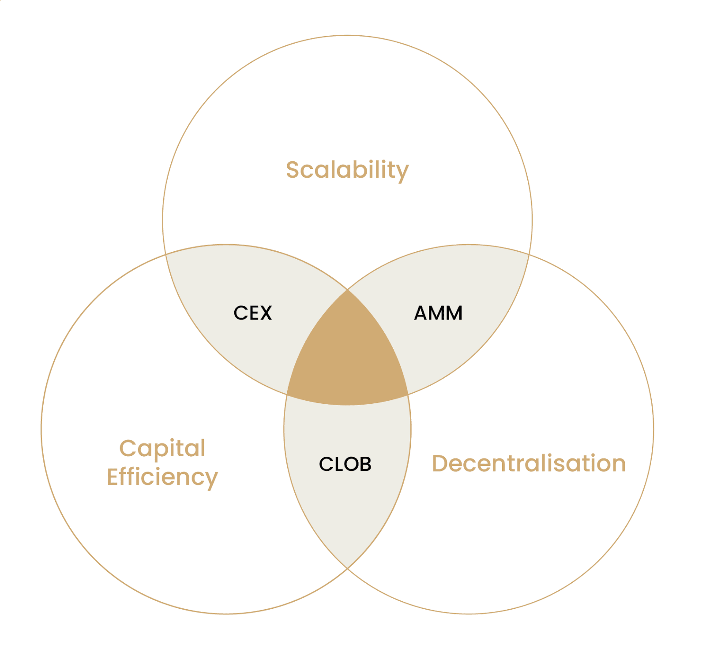
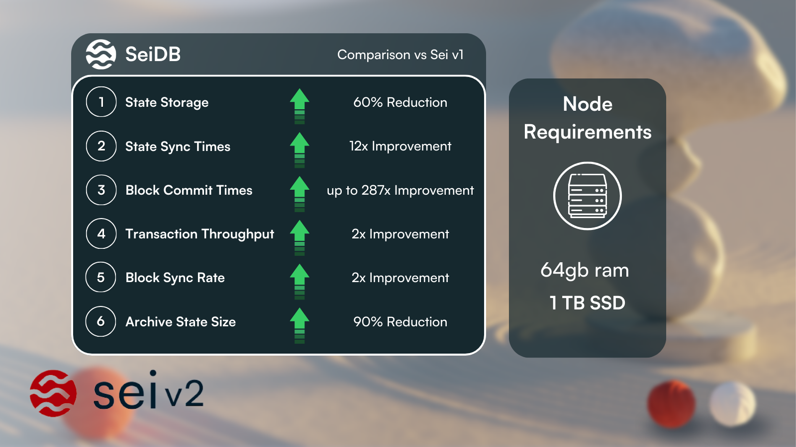
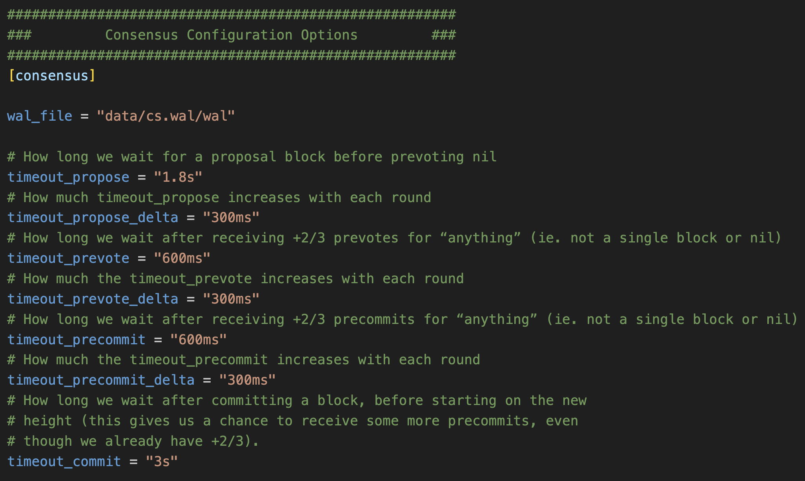
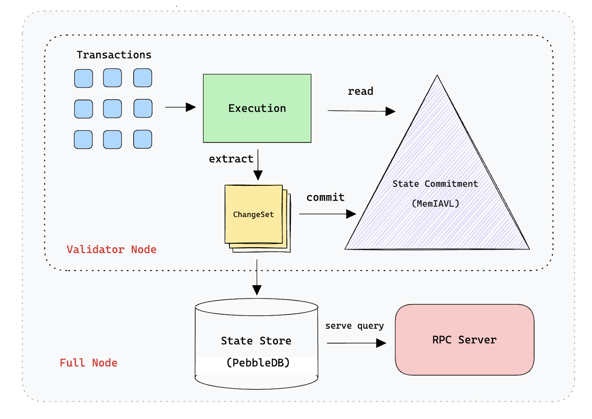

# Sei는 특별한가?

## 1. 들어가며

최근 가장 흥미롭게 지켜보고 있는 프로젝트가 있다. 바로 Sei다. 단순히 최근 시장에서 큰 주목을 받고 있는 것 때문만이 아니라 여러 커뮤니티에서 자주 언급 되고 유명 리서처들이 관련 글을 쏟아내고 있기 때문이다. 이런 모습이 정말로 괜찮은 프로젝트이기 때문인 것인지 아니면 초기 커뮤니티 형성과 생태계 확장을 위한 단순한 크립토 실링(crypto shilling)인지 알기 위해 본 아티클을 작성하게 되었다. L1 시장은 롤업 기반의 L2 서비스나 dApp과는 확실하게 다른 성격과 결이 다른 차별점을 필요로 한다. L2나 dApp이 호환성이나 서비스로써의 특징을 강조한다면, L1은 하나의 생태계로서의 역할을 해야하며 다른 L1들과는 경쟁적 관계에 있다는 숙명을 갖고 있다. Sei에서 말하는 다른 L1들과 차별을 두는 특별한 강점(Selling point)이 무엇이고 그 강점들에 대해 조금 비판적인 시선으로 하나씩 살펴보도록 하겠다.

## 2. Sei의 Selling Point

### 가장 빠른 파이널리티

더 빠른 블록체인, 즉각적인 트랜잭션 처리, 현존하는 블록체인 중 가장 빠른 파이널리티. Sei에 대해서 처음 알게 되면서 가장 많이 들은 문구들이다. 실제로 Sei는 파이널리티를 자랑하는 Aptos (900ms)나 Solana(1500ms)에 비해 훨씬 빠른 속도를 보여주고 있다.

거래 체결은 트랜잭션이 블록에 포함되는 것을 의미하기에 파이널리티가 거래 체결 속도와 직접적인 상관 관계를 보여준다. Sei는 거래소 트릴레마를 해결하기 위해 이와 같은 빠른 파이널리티를 강조하고 있다. 거래소 트릴레마는 거래소가 갖는 세 가지 속성 중 두 가지만 선택할 수 있다는 개념을 말한다. 세 가지 속성은 다음과 같다.

- **Decentralization**: 거래소가 분산화되어 있어 중앙화된 권한이 없다.
- **Capital Efficiency**: 거래소가 사용자의 자원과 유동성을 효과적으로 사용할 수 있다.
- **Scalability**: 거래소가 높은 처리량을 갖고 있어 사용자가 원하는 시간에 거래를 할 수 있다.

Sei는 중앙지정주문가 (central limit order book, CLOB) 방식을 채택하는 탈중앙화 거래소로서 자본 효율성과 탈중앙성을 해결하고 있다. 그렇기에 Sei에게 필요한 것은 Scalability이기에 빠른 파이널리티가 중요한 것이다. Sei는 앱 특화(app-specific)를 강조하던 기존 크립토 생태계에서 첫 번째로 섹터 특화(sector-specific)이란 네러티브로서 등장한 만큼 트레이딩 플랫폼으로써 시장에서 특별한 강점을 가지고 있다.

### 병렬 EVM을 통한 트랜잭션 처리

Sei v2가 소개되며 생태계 확장을 위한 EVM을 공식적으로 Sei에서 지원하게 되었다. Cosmos SDK와 EVM과 매끄러운 호환을 위한 Address Translator나 EVM 모듈을 통한 별도의 추가 작업 없이 Solidity 코드를 Sei에서 구동시키는 것을 가능하게 하였다. 하지만 이는 BeraChain이나 Evmos 등과 같은 프로젝트에서 이미 유사한 경험을 제공하고 있으며 중요한 차이점은 ‘첫 병렬 EVM’을 지원한다는 것이다. EVM 생태계에서 병렬 EVM이라는 네러티브가 제안되고는 있지만 모놀리틱 체인에서는 체인의 여러 요소(합의, 블록, 트랜잭션 등)들이 유기적으로 연동되어 있기 때문에 개발적인 어려움이 있다. 하지만 Sei는 Cosmos SDK 기반의 체인으로 모듈러 블록체인의 특색을 살려 블록을 생성하는 Tendermint 합의 엔진을 수정하여 병렬 처리를 구현하였다. 
트랜잭션을 병렬로 처리하는 과정은 블록체인의 특성상 결코 쉬운 작업이 아니다. 단일 노드일 경우엔 상관이 없지만 여러 노드가 상태를 공유하는 상황에서는 서로 다른 병렬 처리는 곧 밸리데이터 노드들 간의 상태 불일치, 즉 비결정성(non-determinism)을 발생시킬 수 있기 때문이다. 계정 간 잔고의 이동과 같은 트랜잭션 간의 순서가 중요한 경우 잔고의 값(노드의 상태)을 보장하기 위해 순차적으로 처리해야 한다. 이러한 문제를 해결하기 위해 Sei는 낙관적 동시성 제어 (Optimistic Parallelization)이라는 방식을 사용하고 있다. 이 방식은 트랜잭션을 병렬로 처리하되, 트랜잭션 간의 순서가 중요한 경우에는 순차적으로 처리하도록 하는 방식이다. Sei는 이를 통해 높은 처리량을 유지하면서도 트랜잭션의 순서를 보장할 수 있다. 

이외에도 Sei는 Cosmos SDK에서 기본적으로 제공되는 DB를 변경한 SeiDB를 제안하였다. SeiDB는 상태 불일치 및 동기화 시간 소요 같은 문제를 해결하며 노드 하드웨어 요구 사항을 낮게 유지하면서 병렬 실행을 고려하여 설계되었다. 이러한 기술적인 특징들은 Sei가 높은 TPS를 처리하기 위한 기술적인 특징들로써 특별한 강점을 가지고 있다.

### 트레이딩을 위한 범용 L1 체인

Sei는 트레이딩을 위한 범용 L1 체인이라는 네러티브를 강조하고 있다. DeFi 어플리케이션으로써 최적의 환경을 제공하기 위해 아래와 같은 특별한 기능들이 제공된다.

- Native Order Matching Engine: 범용 목적을 가진 L1 체인의 경우 거래 실행에서 자동화된시장조성자 (AMM) 방식에 의존하는 것과 달리 Sei는 자체 오더북을 제공하고 있다. 이는 구매자와 판매자가 직접적으로 거래를 할 수 있게 하며 더 낮은 슬리피지와 더 높은 유동성을 제공하는 것이 가능하다. 이를 통해 사용자들은 더 낮은 거래 비용과 더 높은 거래 효율을 기대할 수 있다.
- Native Price Oracles: 오더북 방식을 제공하기 위해서는 거래에 사용되는 정확한 가격 정보를 오라클을 통해 제공해야만 한다. 오라클 데이터는 밸리데이터들이 블록 생성 시 함께 제공하도록 구현되어있으며 정확한 최신 데이터를 유용하기 위한 여러 방법들 제안되어있다.
- Frequent Batch Auctioning (FBA): Sei는 FBA 방식을 통해 모든 시장 주문에 대한 정보를 수집하여 일률적인 청산 가격을 제공하고 있다. 이 방식을 통해 트랜잭션 순서를 조작하여 이익을 탈취하는 프론트러닝 공격 (front-running attack)을 방지하고 더 공정한 거래 환경을 제공하고 있다.

## 3. Sei는 특별한가?

### 빠른 파이널리티의 함정

트레이딩에 특화된 체인을 강조하기 위해 Sei는 파이널리티 속도에 대한 큰 자부를 갖고 있다. 하지만 사실 Cosmos SDK 기반의 체인들은 기본 셋팅으로 블록 생성 시간을 조절할 수 있는 옵션을 제공하고 있다. 

Cosmos SDK에서 체인의 설정을 조정하는 `config.toml`에서 합의 설정을 보면 `timeout_commit` 이라는 파라미터가 존재하는데, 이 파라미터는 블록이 생성되고 나서 다음 블록이 생성되기까지의 시간을 조절하는 파라미터이다. 이 파라미터를 조정함으로써 블록 생성 시간을 조절할 수 있으며 이를 통해 파이널리티 속도를 높일 수 있다. 이러한 설정을 통해 1초 이하의 파이널리티를 달성하는 것은 어렵지 않다. 즉, 트랜잭션 처리량과는 별개로 단순히 BFT 합의 방식을 기반으로 블록 생선 속도를 높여 파이널리티를 낮추는 것은 가능하다는 것이다.

빠른 파이널리티가 유의미한 가치를 가지기 위해서는 짧은 블록 생성 시간 내에 많은 트랜잭션이 블록에 포함될 수 있는 것이 중요하다. 너무 빠른 파이널리티로 인해 특정 시점에 제출한 트랜잭션이 바로 다음 블록이 아닌 수 블록 후에 저장된다면 큰 의미를 가지지 못한다. 빠른 파이널리티를 위해 고려해야 할 중요한 요소는 통신 해야할 노드의 수와 네트워크의 전송 속도이다. 통신해야하는 노드가 많을 수록, 노드들 간의 물리적 거리가 멀수록, 파이널리티의 속도는 증가하게 된다. Sei에서 제한된 환경에서는 250ms의 파이널리티를 달성하였지만 실제 메인넷에서는 그 이상의 시간이 소요되고 있는 것이 이러한 이유 때문이다. 통신 속도와 블록 생성 시간 보다 낮은 파이널리티는 이론적으로 불가능 하다는 것을 의미한다. Sei에서 말하는 제한적인 환경이란 이런 것을 고려하였을 때 통신하는 노드 수를 일부로 제한하며, 노드 간의 물리적 거리를 최소화하였다는 것을 의미한다. 이런 제한은 실제 서비스 환경에서는 무의미한 가정이기에 극단적으로 낮은 파이널리티를 강조하는 것은 일종의 마케팅 수단이라 볼 수 있다.

### 병렬 EVM을 위한 Sei의 기술

Sei는 병렬 EVM을 달성하기 위해 Optimistic Parallelization을 핵심적인 기술로 제안하고 있다. 하지만 이 방식은 Sei에서 처음 개발한 기술은 아니고 Aptos의 Block-STM 알고리즘과 유사한 방식을 사용하여 구현되었다. Sei가 EVM에 Block-STM을 적용한 것은 특이할 점이나 Sei가 병렬 처리에 있어서 선구적이며 독보적이라고 하기에는 아직 검증이 필요하다. 
또다른 기술적 차별점으로 SeiDB를 강조하고 있지만 사실 Cosmos SDK를 활용하는 생태계 내에서는 IAVL트리 구조의 데이터베이스를 커스텀하여 자신들의 비즈니스 로직에 맞게 수정하는 것은 흔한 일이다. 

SeiDB의 특징을 짧게 요약하면 하나의 큰 데이터베이스를 두 개의 서로 다른 레이어로 분리하는 것이 핵심이다.

- State Commitment: 머클 트리 형태의 메모리 상의 체인의 상태 정보를 저장하는 역할을 담당하며 빠른 상태 접근과 머클 해싱을 제공하는 데이터베이스 
- State Store: 아카이브 노드로 모든 과거 상태를 조회하는 역할을 담당하는 데이터베이스

데이터베이스를 분리함으로써 Sei는 분명 데이터 저장에 있어서 효율성과 최적화의 관점에서는 충분한 이점을 가지고 있다. 하지만 이런 개선과는 별개로 다음과 같은 잠재적인 문제가 있을 수 있다. 

- 상태 저장의 복잡성: 상태 저장을 위해 두 개의 데이터베이스를 사용함으로써 상태 저장의 복잡성이 증가하게 된다. 이러한 복잡성은 잠재적인 버그나 취약점을 발생시킬 수 있으며 특히 두 레이어 간의 동기화에 있어서 문제가 발생할 수 있다. 
- 낙관적 병렬 처리에 대한 의존: SeiDB의 성능 향상은 낙관적 병렬 처리에 의존하고 있는데, 이는 트랜잭션이 충돌 없이 병렬로 처리될 수 있다는 가정에 기반하고 있다. 이 가정이 실패할 경우 트랜잭션 처리 지연이나 복잡한 충돌 해결 메커니즘이 필요할 수 있으며 이는 전체적인 처리량과 효율성에 영향을 미칠 수 있다.
- 하드웨어 요구 사항: 노드 하드웨어 요구 사항이 낮다고 주장하고 있지만 성능의 큰 향상과 저장 최적화는 여전히 높은 컴퓨팅 파워를 요구할 수 있다. 특히 빠르게 많은 트랜잭션을 처리해야 하는 밸리데이터 노드에게 더욱 높은 요구 사항을 요구할 수 있다.
- 상태 변경을 위한 Write-Ahead Logging (WAL): 비동기 상태 변경을 위한 WAL의 사용은 성능을 향상시키지만 WAL이 상태 저장소에 플러시되기 전에 실패할 경우 데이터 손실이나 손상의 위험을 초래할 수 있다. 이는 블록체인 상태의 무결성에 영향을 미칠 수 있으며 일관성을 보장하기 위한 강력한 복구 메커니즘이 필요할 수 있다.

결과적으로, SeiDB는 블록체인 저장 및 성능 최적화에 있어서 큰 발전을 보여주고 있지만 관련된 잠재적인 문제에 대한 주의가 필요하다. 앞서 예상되는 문제에 대한 지속적인 모니터링, 테스트 및 업데이트가 필요하며 이는 Sei의 신뢰성과 효율성을 보장하기 위해 필수적이다.
 

### L1 체인으로서의 포지션

기존의 Cosmos SDK 기반의 DEX 특화 체인들과 비교하였을 때 Sei가 정말 특별한가에 대한 고민을 많이 하게 되었다. 고빈도 매매 (High-frequency Trading, HFT)나 대규모 거래에서는 Sei의 장점이 명확하다. 정해진 가격으로 빠른 거래 체결이 가능하다는 것은 Osmosis와 dYdX와 비교하였을 때 갖는 확실한 강점이다. 하지만 L1 체인으로서의 포지션을 강조하기 위해서는 결국 Sei 토큰의 유틸리티가 중요하다. 현재 제안된 Sei 토큰의 유틸리티로는 네트워크 수수료, 스테이킹, 거버넌스 등이 있다. 하지만 이러한 유틸리티들은 다른 L1 체인들과 큰 차이를 보여주지 않는다. 예를 들어 Osmosis에서는 $OSMO를 이용하여 Superfluid, Supercharged를 통해 스테이킹에 대한 인센티브를 제공하고 dYdX는 $dYdX를 스테이킹 하였을 때 거래에서 사용되는 다양한 파라미터를 변경하는 데 거버넌스를 통해 참여할 기회를 제공한다. 하지만 Sei 토큰 유틸리티는 현 시점에서 명확하게 제안된 것이 없다. 낮은 수수료 같은 장점은 가스 수수료로 사용되는 $Sei의 가격이 낮기 때문인 것이니 특별한 장점이 될 수 없다. 

또한 Sei가 지향하는 트레이딩 특화 L1이라는 네러티브를 지지할 dApp이 부족하다고 생각된다. 현재 많은 팀들이 Sei 생태계에 온보딩을 하고 있지만 Sei가 강조하는 ‘트레이딩 특화 L1’이라는 네러티브를 지지할 dApp이 부족하다고 생각된다. 궁극적으로 Sei가 지향하는 것이 거래소 트릴레마를 해결하려는 L1이라면 트레이딩 이외에 Game이나 NFT 같은 dApp들이 Sei에 온보딩 하는 이유가 의문이다.

마지막으로는 롤업 네러티브의 부재가 큰 문제로 생각된다. L1인 Sei는 결국 모든 과거 및 현재 데이터를 다수의 노드가 저장하고 공유해야 하는 블록체인의 구조적 특성 때문에, 일정 규모 이상으로 성장할 경우에는 한계에 부딪힐 수밖에 없다. Sei에 수 많은 dApp들이 있을 때 여러 앱들이 서로에게 영향을 줄 수밖에 없어 롤업을 이용한 L2 도입이 필요하게 될 것이다. 하지만 아직 Sei에서는 L1 생태계에만 집중할 뿐 롤업과 L2에 대한 전략이 부재한다.

## 4. 맺으며

필자는 코스모스 생태계 빌더로서 일하다 보니 Sei와 기술이나 서비스적으로 유사한 프로젝트들을 많이 접하게 될 기회가 있었고 그러다보니 Sei에 대해 다소 비판적인 시선을 갖고 아티클을 작성하게 되었다. 하지만 현재(2024년 2월)를 기준으로 Sei가 이전에 봤던 다른 프로젝트들 보다 훨씬 성공하고 빠르게 성장하고 있다는것은 반박할 수 없는 사실이다. 현재 오피셜하게 공개된 정보로만 봐도 이름 있는 수 많은 프로젝트들이 Sei와 함께 생태계를 구축해나가고 있다. 새로운 L1 네러티브에 대하여 긍정적으로 생각하는 독자가 있다면 Sei가 앞으로 L1 시장에서 어떤 행보를 보이며 성장해나갈지 지켜볼 필요가 있다고 생각된다.

## 5. 참고자료

- [Sei Website](https://www.sei.io/)
- [Sei Blog](https://blog.sei.io/)
- [[Infrastructure] Sei v2 — “첫 병렬 EVM 블록체인"의 타이틀을 가져갈 수 있을까](https://medium.com/@0xO_Oi/infrastructure-sei-v2-%EC%B2%AB-%EB%B3%91%EB%A0%AC-evm-%EB%B8%94%EB%A1%9D%EC%B2%B4%EC%9D%B8-%EC%9D%98-%ED%83%80%EC%9D%B4%ED%8B%80%EC%9D%84-%EA%B0%80%EC%A0%B8%EA%B0%88-%EC%88%98-%EC%9E%88%EC%9D%84%EA%B9%8C-b1b339a2c08f)
- [sei-v2-the-first-parallelized-evm](https://blog.sei.io/sei-v2-the-first-parallelized-evm/)
- [parallel-transaction-message-processing](https://forum.sei.io/t/parallel-transaction-message-processing/20)